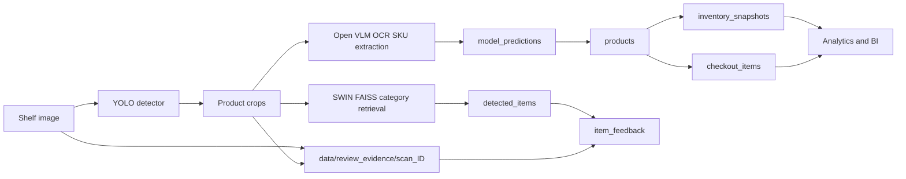
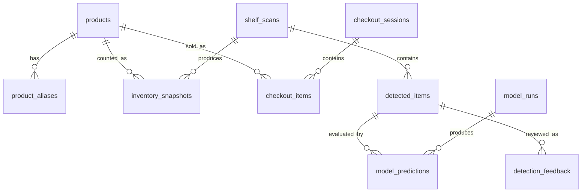

# SKU / Inventory / Checkout Database Schema

This schema is the shared data model for the next phase of the project: turning shelf-image
detections into a product catalog, inventory records, and automatic checkout line items.

The current app already stores scan-level analytics in `backend/inventory_db.py`. This design
keeps that local SQLite path working, but expands the model so it can later move to Postgres or
Cloud SQL without changing the application concepts.

## Data Flow

## Core Concepts

- **Product master**: canonical SKU rows used by inventory, BI, and checkout.
- **Aliases**: OCR text, packaging variants, FAISS labels, or brand abbreviations mapped to a
  canonical product.
- **Shelf scans**: one uploaded shelf image or video frame.
- **Detected items**: one YOLO crop/detection from a scan.
- **Model predictions**: per-crop outputs from OCR/VLM experiments and production runs.
- **Inventory snapshots**: product quantities inferred from scans.
- **Checkout sessions/items**: automatic checkout header and line-item records.
- **Model runs**: benchmark metadata so we can compare Qwen-VL, PaliGemma, Gemma 3, and Gemini
  reference runs without mixing outputs.
- **Human feedback**: immutable prediction context plus an operator's category or SKU verdict and
  optional correction, retained for later evaluation or retraining.

## Entity Relationship Summary

## Operator UI Runtime Tables

The React/FastAPI operator UI currently uses the compact SQLite tables in
`backend/inventory_db.py`. They map to the expanded concepts below as follows:

### `scans`

One completed upload. In addition to scan KPIs, `image_name` preserves the client filename and
`image_path` points to a normalized JPEG saved under
`$FEEDBACK_ASSET_DIR/scan_<id>/source.jpg`. The default asset root is
`data/review_evidence`; image bytes are deliberately kept out of SQLite.

### `items`

One retained detection per scan. `crop_id` identifies it within the scan, `box` contains the
JSON-encoded `[x1, y1, x2, y2]` source-image coordinates, and `crop_path` points to
`crop_<crop_id>.jpg`. The row also stores the category/subcategory, retrieval score, and the
SKU/OCR prediction fields.

### `item_feedback`

One upserted operator verdict per `(scan_id, crop_id, feedback_type)`, where `feedback_type` is
`category` or `sku`.

| Column | Type | Purpose |
|---|---|---|
| `id` | integer pk | Feedback record id |
| `scan_id`, `crop_id` | integer | Detection identity |
| `feedback_type` | text | `category` or `sku` |
| `verdict` | text | `correct` or `incorrect` |
| `correction`, `note` | text | Optional operator correction and note |
| `source_image_path`, `crop_image_path` | text | Review-evidence paths captured with the scan |
| `box` | text | Snapshot of the source coordinates as JSON |
| `predicted_category`, `predicted_subcategory` | text | Category prediction at review time |
| `predicted_sku_text`, `predicted_visible_text` | text | SKU/OCR prediction at review time |
| `predicted_sku_confidence` | real | SKU confidence at review time |
| `ts` | text | Latest submission timestamp |

Prediction and evidence fields are copied into the feedback row when a verdict is submitted. This
keeps later exports reproducible even if the live item row is subsequently corrected. Existing
SQLite files are migrated non-destructively by adding any missing optional columns during
`init_db()`. Evidence paths are not returned by the public scan APIs. Deployments must place
`FEEDBACK_ASSET_DIR` on persistent encrypted storage and apply an organization-approved retention
policy because uploaded shelf images may contain people or other sensitive content.

## Tables

### `products`

Canonical product/SKU catalog. One row per sellable SKU.

| Column | Type | Purpose |
|---|---|---|
| `id` | integer pk | Internal product id |
| `sku_code` | text unique | Internal SKU code used by checkout/inventory |
| `barcode` | text unique nullable | UPC/EAN/barcode if visible or known |
| `brand` | text nullable | Brand, e.g. Coca-Cola |
| `product_name` | text not null | Canonical product name |
| `category` | text | Current category label |
| `subcategory` | text | Current subcategory label |
| `package_size` | text nullable | Pack/size text, e.g. 500 ml |
| `unit_price` | real | Price used for checkout demo |
| `tax_rate` | real | Tax rate used for checkout demo |
| `active` | integer | 1 if sellable |
| `created_at`, `updated_at` | text | Audit timestamps |

### `product_aliases`

Maps noisy recognition outputs to a product. This is important because crop OCR can return
variants like `coke can`, `Coca Cola`, `Coca-Cola 330ml`, or partial package text.

| Column | Type | Purpose |
|---|---|---|
| `id` | integer pk | Alias id |
| `product_id` | fk products | Canonical product |
| `alias_text` | text | OCR/label/name variant |
| `alias_type` | text | `ocr`, `faiss`, `manual`, `barcode`, `brand_variant` |
| `confidence` | real | Confidence in the mapping |
| `source` | text | Source model or user |
| `created_at` | text | Audit timestamp |

### `shelf_scans`

One analyzed shelf image/frame.

| Column | Type | Purpose |
|---|---|---|
| `id` | integer pk | Scan id |
| `session_id` | text nullable | Logical session / upload batch |
| `image_name` | text | Original filename |
| `image_path` | text nullable | Local/GCS path |
| `store_id`, `shelf_id`, `camera_id` | text nullable | Operational metadata |
| `captured_at` | text | Source capture time |
| `processed_at` | text | Pipeline run time |
| `num_items` | integer | Number of classified detections retained |
| `detector_box_count` | integer | Raw YOLO box count |
| `distinct_categories` | integer | Distinct non-unknown categories |
| `empty_pct` | real | Estimated empty shelf area |
| `shelf_type` | text | `Mixed`, `Category-specific`, `Unknown` |
| `review_count` | integer | Unknown / low-confidence detections |

### `detected_items`

One row per detected product crop.

| Column | Type | Purpose |
|---|---|---|
| `id` | integer pk | Detection id |
| `scan_id` | fk shelf_scans | Parent scan |
| `product_id` | fk products nullable | Resolved product if known |
| `crop_id` | integer | Crop number inside the scan |
| `crop_path` | text nullable | Saved crop path |
| `bbox_x1`, `bbox_y1`, `bbox_x2`, `bbox_y2` | integer | Bounding box |
| `detector_confidence` | real nullable | YOLO confidence if available |
| `retrieval_category` | text | SWIN/FAISS category |
| `retrieval_subcategory` | text | SWIN/FAISS subcategory |
| `retrieval_score` | real | FAISS distance; lower means nearer |
| `vlm_brand`, `vlm_product_name`, `vlm_sku_text` | text nullable | OCR/VLM parsed output |
| `vlm_visible_text` | text nullable | Raw visible package text |
| `vlm_confidence` | real nullable | Model self-confidence |
| `route` | text | `retrieval`, `vlm`, `manual`, `checkout` |
| `review_status` | text | `auto`, `needs_review`, `approved`, `rejected` |
| `created_at` | text | Audit timestamp |

### `inventory_snapshots`

Count of a product inferred at a point in time.

| Column | Type | Purpose |
|---|---|---|
| `id` | integer pk | Snapshot id |
| `product_id` | fk products | Product counted |
| `scan_id` | fk shelf_scans nullable | Source scan |
| `quantity` | integer | Count inferred |
| `confidence` | real | Aggregate confidence |
| `source` | text | `shelf_scan`, `manual`, `checkout_adjustment` |
| `observed_at` | text | Observation timestamp |

### `checkout_sessions`

Automatic checkout transaction header.

| Column | Type | Purpose |
|---|---|---|
| `id` | integer pk | Checkout session id |
| `session_key` | text unique | External/user-facing session id |
| `store_id`, `device_id`, `customer_id` | text nullable | Optional metadata |
| `started_at`, `completed_at` | text nullable | Session timing |
| `status` | text | `open`, `completed`, `review`, `void` |
| `subtotal`, `tax`, `total` | real | Amounts |

### `checkout_items`

Line items generated from detections.

| Column | Type | Purpose |
|---|---|---|
| `id` | integer pk | Checkout line id |
| `checkout_session_id` | fk checkout_sessions | Parent checkout |
| `product_id` | fk products | Sold product |
| `detected_item_id` | fk detected_items nullable | Source detection |
| `quantity` | integer | Usually 1 per detection |
| `unit_price`, `tax_rate`, `line_total` | real | Pricing |
| `confidence` | real | Product resolution confidence |
| `review_status` | text | `auto`, `needs_review`, `approved`, `rejected` |

### `model_runs`

One benchmark or production model run.

| Column | Type | Purpose |
|---|---|---|
| `id` | integer pk | Run id |
| `run_name` | text unique | Human-readable run key |
| `model_name` | text | e.g. `Qwen2.5-VL-7B-Instruct` |
| `provider` | text | `vertex-vllm`, `vertex-model-garden`, `gemini`, `local` |
| `endpoint` | text nullable | Endpoint URL/resource |
| `prompt_version` | text | Prompt/schema version |
| `sample_size` | integer | Number of crops requested |
| `started_at`, `finished_at` | text nullable | Run timing |
| `status` | text | `running`, `completed`, `failed` |
| `json_parse_rate`, `error_rate`, `avg_latency_s` | real nullable | Aggregate metrics |
| `notes` | text nullable | Free-form result notes |

### `model_predictions`

Per-crop output from each model.

| Column | Type | Purpose |
|---|---|---|
| `id` | integer pk | Prediction id |
| `model_run_id` | fk model_runs | Parent run |
| `detected_item_id` | fk detected_items nullable | Detection row if available |
| `crop_path` | text | Crop image path |
| `filename` | text | Crop filename |
| `raw_response` | text | Raw model response |
| `parse_ok` | integer | 1 if JSON parsed |
| `brand`, `product_name`, `sku_text`, `visible_text` | text nullable | Parsed output |
| `package_size`, `barcode`, `category_hint` | text nullable | Parsed output |
| `confidence` | real nullable | Model self-confidence |
| `needs_review` | integer | 1 if model says review needed |
| `latency_s` | real | Per-crop latency |
| `error` | text nullable | Error text |

## Checkout Resolution Strategy

For automatic checkout, a detection becomes a line item only after product resolution:

1. Match barcode if visible.
2. Match `sku_text` or product name against `product_aliases`.
3. Use FAISS/retrieval category as a filter, not as final SKU identity.
4. If confidence is below threshold, mark the line as `needs_review`.
5. Approved checkout items decrement inventory through an `inventory_snapshots` or later
   `inventory_events` layer.

## Local vs Cloud

- Local demo: SQLite file (`inventory.db`) with this schema.
- Later deployment: Cloud SQL/Postgres with the same logical tables.
- Crop/model benchmark artifacts remain in GCS; the DB stores paths and parsed metadata, not image
  bytes.
